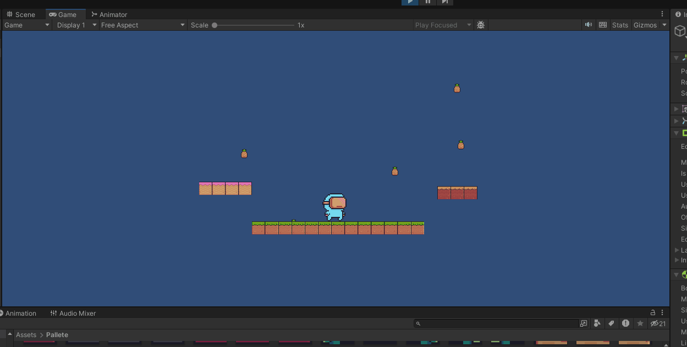

#FDV; Sonido y Polling

### ¿Que pasa al aumentar el Spread?
Se siente menos cuando el emisor se aleja de nosotros porque el audio pasa a estar más extendido por el espacio. Y tardamos más tiempo en dejar de oirlo.

### ¿Que pasa al cambiar Min y Max distance?
Que el disminuir el max distance el sonido se atenua más rápido  y al aumentar el min distance el sonido está a maxima potencia por más espacio

### ¿Que pasa al cambiar la curva de Logarithmic Rollof a Linear Rollof?
Que la relación entre distancia y volumen pasa de regirse por una funcion logaritmica a ser una relación direccional 

### Pooling de objetos

